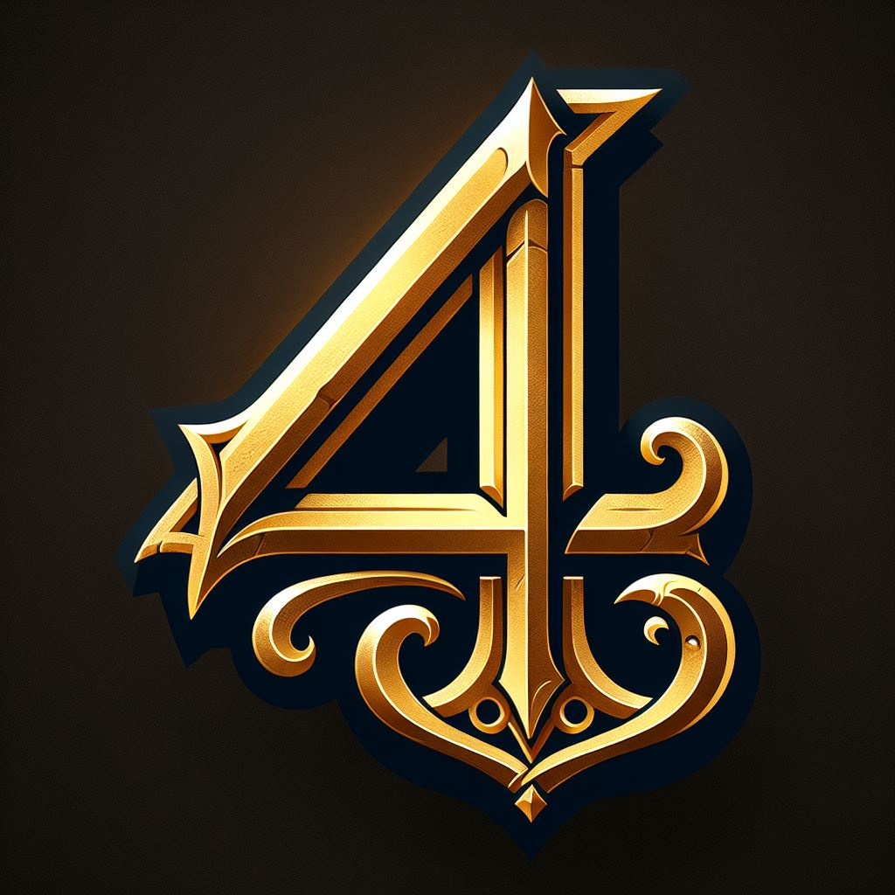

# 4Ever



## Introduction

4Ever is an MMORPG-inspired decentralized application (DApp) that leverages blockchain technology to manage the in-game economy, asset ownership, and decentralized governance. The project aims to provide a secure and transparent environment for players to trade in-game assets, maintain ownership through NFTs (Non-Fungible Tokens), and participate in the governance of certain aspects of the game.

## Setup

### Prerequisites

Make sure you have the following installed:

- Node.js: [Download and Install Node.js](https://nodejs.org/)
- npm (Node Package Manager): Installed with Node.js
- Truffle: [Install Truffle](https://www.trufflesuite.com/truffle)
- Ganache: [Install Ganache](https://trufflesuite.com/ganache/)

### Installation

1. Clone the repository:

   ```bash
   git clone https://github.com/your-username/4Ever.git
   cd 4Ever

2. Install dependencies:
    ```bash
    npm run install-all
    